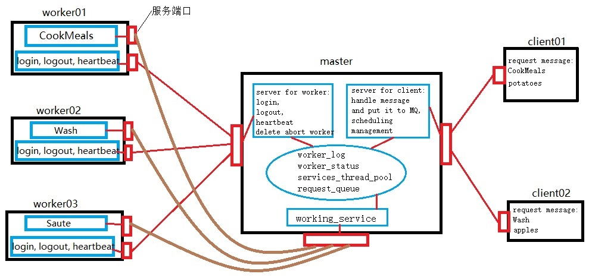

## 小型分布式框架

### 介绍

此分布式框架拥有一个master_node和多个work_node，work_node启动时需要向MN进行服务注册，启动后需要定时向MN发送心跳以告知MN自己还活着（生命检测机制），MN维护一个消息队列MQ，用于收发消息，同时创建一个线程池，进行调度管理。客户端Client通过MN来完成一些work。

此分布式小型框架拥有一个主节点（master）和多个工作节点（worker），每个worker都提供某个（或某些）服务（service），当worker启动服务后，需要向master进行服务注册（login），以告知master自己提供的具体服务。在服务注册后worker需要定时向master发送心跳以证明自己处于working状态（心跳机制/生命检测机制）。主节点master开启两个端口，分别监听来自worker和client（客户端）的请求。master为worker提供服务注册（login）、服务注销（logout）、心跳接收（heartbeat）及删除意外终止工作节点（delete abort node）的注册信息服务；master为client提供消息队列（message queue）处理服务及服务调度管理（scheduling management）服务。master为每一个worker注册过的服务维护一个服务线程池，以管理各个服务的并发线程数（线程池的最大线程数来自服务注册信息）。同时master还维护一个先进先出的消息队列，当master接收到来自client的请求时，并不立刻响应，而是将请求消息经过处理后放入消息队列中。master时刻运行着服务调度管理，若消息队列不为空，则获取消息数据并根据其服务信息找到相应的工作节点worker，若此worker处于working状态，则master会通过working_service服务向指定worker发起服务请求，得到处理结果后，再将此结果返回给相应client。

在master节点内共维护四个全局变量：（1）worker_log用来存储每个worker的注册信息；（2）worker_status用来存储每个worker的状态信息（分为working和unworking状态）；（3）services_thread_pool用来存放每个已注册服务的工作节点的线程池；（4）request_queue作为消息队列，存放来自client的请求消息（数据结果处理）。

在本系统中，worker提供的服务其内部实现也可以调用其他worker的服务，所有worker提供的服务对其他worker及client而言是透明的，其他worker及client不需要关心该服务内部具体如何实现，也不需要关心提供该服务的worker所在的具体位置（如worker的ip及port等信息），而只需要关心服务名，通过向master提供服务名及所需参数就可以使用该服务。

本文以一个具体的应用场景来描述该分布式框架系统。系统中包含一个master，三个worker和两个client。worker01提供做饭（CookMeals）服务，该服务需按顺序调用两个子服务：洗菜（Wash）服务和炒菜（Saute）服务。worker02提供Wash服务，worker03提供Saute服务。clinet01请求做一盘土豆的菜；client02请求洗苹果。整个系统的架构如下图所示：

本系统由Python3编写，各个节点的ip地址、端口号等参数保存至相应的.conf文件中，其各个功能模块具体设计说明如 ***系统设计说明.pdf*** 文件所述。